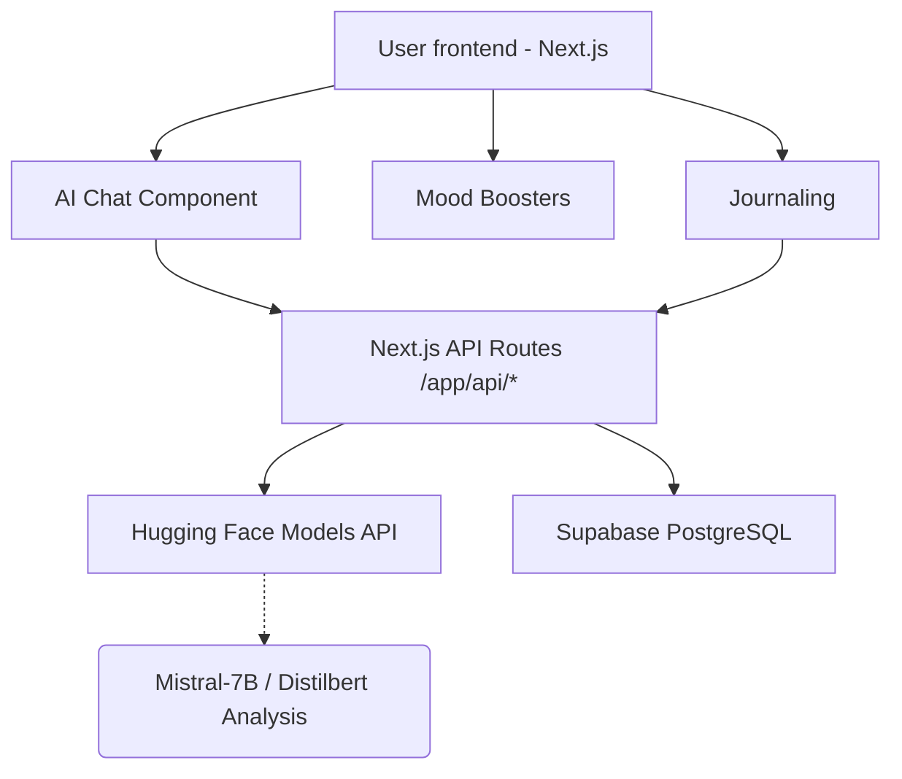

# 🧠 AI Mental Health Support Assistant

A completely free-tier optimized AI Mental Health Assistant built with Next.js 14, Tailwind CSS, Supabase, and Hugging Face. This project is optimized for deployment on Vercel and designed for hackathons!

## 🌟 Features

* **AI Therapy Chat**: A warm and empathetic conversational chat model powered by Hugging Face `Mistral/Llama`. Features voice-to-text (Web Speech API).
* **Smart Journal & Mood Tracking**: Log your mood and write free-text thoughts. Data is recorded to Supabase for emotional insights.
* **Mood Boosters**: Take a break with calming mini-games (Breathing bubble, Smile interaction, Memory matcher). 
* **Crisis Safety Engine**: Real-time detection of crisis keywords (like "suicide" and "hopeless"), stepping in safely to provide critical distress lifelines.

## 📐 Architecture Diagram


## 🛠 Tech Stack
- Frontend: Next.js 14, Tailwind CSS, Lucide React, Framer Motion
- Backend: Next.js API Routes
- AI Provider: Hugging Face (Free Tier)
- Database: Supabase (Free Tier)
- Machine Learning Client: Web Speech API (Native)

## 🚀 Setup & Deployment Guide

### 1. Supabase Initialization
- Sign up for Supabase and create a new project.
- Go to the **SQL Editor**, and execute the `supabase_schema.sql` file provided in this repository to setup your tables.
- Go to Project Settings -> API and copy your **Project URL** and **Anon Key**.

### 2. Hugging Face Setup
- Create a [Hugging Face](https://huggingface.co/) free account.
- Go to `Settings` > `Access Tokens` to create a free read token. 

### 3. Environment Variables
Add `.env.local` to the root folder:
```env
NEXT_PUBLIC_SUPABASE_URL=your_supabase_url
NEXT_PUBLIC_SUPABASE_ANON_KEY=your_anon_key
HUGGINGFACE_API_KEY=your_hugging_face_key
```

### 4. Vercel Deployment

1. Go to [Vercel](https://vercel.com).
2. Create `New Project` and Import the repository.
3. In Environment Variables, insert the `.env.local` keys.
4. The deployment command is pre-filled `npm run build` by Next.js.
5. Hit **Deploy**. 

Congratulations! Your AI Mental Health assistant is up and fully operational.
